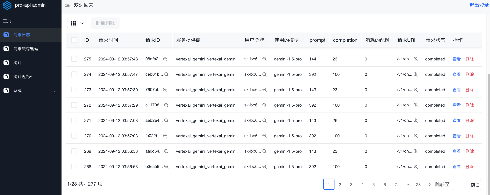
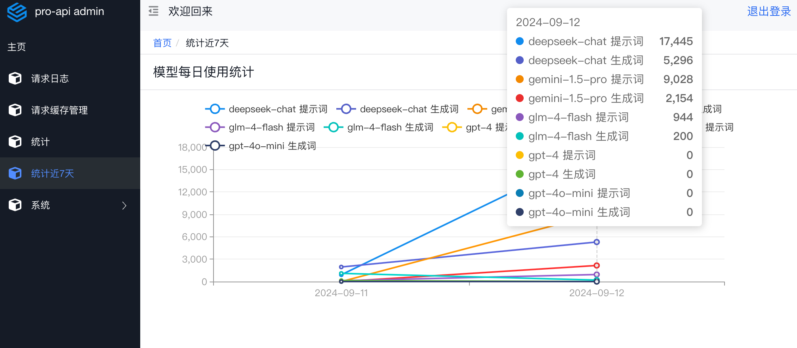

## 介绍

这是一个统一管理大模型API的项目，可以通过OpenAI 的API接口格式调用多个后端服务。

目前支持的后端服务有： OpenAI、Anthropic、Gemini、Vertex、cloudflare、DeepBricks、OpenRouter 等。

## 后台

后台提供请求日志查询使用统计查询

不启动后台就纯转发不记录任何东西






## 配置

使用 api.yaml 配置文件，可以配置多个模型，每个模型可以配置多个后端服务，支持负载均衡。下面是 api.yaml 配置文件的示例：

api.yaml
```
providers:
  - provider: openai
    name: 智谱清言
    base_url: https://open.bigmodel.cn/api/paas/v4
    api_key: 请填写你的api_key
    model:
      - glm-4-flash
      

  - provider: gemini
    name: Gemini
    base_url: https://generativelanguage.googleapis.com/v1beta
    api_key: 请填写你的api_key
    model:
      - gemini-1.5-pro
      - gemini-1.5-flash
      - gemini-1.5-flash: gpt-4o

  - provider: openai
    name: 豆包
    base_url: https://ark.cn-beijing.volces.com/api/v3
    api_key: 请填写你的api_key
    model:
      - ep-20240906033439-zrc2x: doubao-pro-128k
      - ep-20240613130011-c2zgx: doubao-pro-32k
      - ep-20240729175503-5bbf7: moonshot-v1-128k

  - provider: openai
    name: 硅基流动
    base_url: https://api.siliconflow.cn/v1
    api_key: 请填写你的api_key
    model:
      - Qwen/Qwen2-72B-Instruct: qwen2-72b
      - Qwen/Qwen1.5-110B-Chat: qwen1.5-110b
      - deepseek-ai/DeepSeek-V2-Chat: deepseek-chat
#      - deepseek-ai/DeepSeek-Coder-V2-Instruct: deepseek-coder
      - Qwen/Qwen2-7B-Instruct: qwen2-7b
      - Qwen/Qwen2-7B-Instruct: gpt-3.5-turbo
      - Qwen/Qwen2-1.5B-Instruct: qwen2-1.5b
      - Qwen/Qwen1.5-7B-Chat: qwen1.5-7b-chat
      - THUDM/glm-4-9b-chat: glm-4-9b-chat
      - THUDM/chatglm3-6b: chatglm3-6b
      - 01-ai/Yi-1.5-9B-Chat-16K: yi-1.5-9b-chat-16k
      - 01-ai/Yi-1.5-6B-Chat: yi-1.5-6b-chat
      - google/gemma-2-9b-it: gemma-2-9b
      - internlm/internlm2_5-7b-chat: internlm-7b-chat
      - meta-llama/Meta-Llama-3-8B-Instruct: meta-llama-3-8b
      - meta-llama/Meta-Llama-3.1-8B-Instruct: meta-llama-3.1-8b
      - mistralai/Mistral-7B-Instruct-v0.2: mistral-7b


  - provider: openai
    name: deepseek
    base_url: https://api.deepseek.com/v1
    api_key: 请填写你的api_key
    model:
      - deepseek-chat
      - deepseek-coder


  - provider: vertexai_claude
    name: vertexai_claude
    PROJECT_ID: 请填写
    CLIENT_ID: 请填写
    CLIENT_SECRET: 请填写
    REFRESH_TOKEN: 请填写
    model:
      - claude-3-5-sonnet@20240620
      - claude-3-5-sonnet@20240620: claude-3-5-sonnet

  - provider: vertexai_gemini
    name: vertexai_gemini
    PROJECT_ID: 请填写
    CLIENT_ID: 请填写
    CLIENT_SECRET: 请填写
    REFRESH_TOKEN: 请填写
    model:
      - gemini-1.5-flash-001


tokens:
  - api_key: sk-111111
    model:
      - glm* # 可以使用通配符*
      - all # all 代表全部都可以

  - api_key: sk-222222
    model:
      - gpt-3.5-turbo

server:
    default_model: glm-4-flash # 如果匹配不到，则使用这个默认的模型
    debug: false
    admin_server: false # 是否启动后台功能 如果不启动则只转发不作任何记录
    db_cache: false # 相同内容的情况下返回上一次成功的回复
    save_log_file: false
    db_path: sqlite:///./data/request_log.db
    username: admin # 后台用户名
    password: admin # 后台密码
    jwt_secret_key: admin # 随便填不填就随机
```

[vertexai的参数获取教程](./docs/vertexai的参数获取教程.md)


## Docker 本地部署

启动容器

1. 使用本地api.yaml配置文件启动
```bash
docker run -d \
  --name pro-api \
  -p 8001:8000 \
  -v $(pwd)/api.yaml:/app/api.yaml \
  -v $(pwd)/data:/app/data:rw \
  duolabmeng/pro-api:latest
```

2. 使用远程api.yaml配置文件启动
```bash
docker run -d \
  --name pro-api \
  -e config_url=http://你的服务器/api.yaml \
  -e secret_key=123456789 \
  -p 8001:8000 \
  -v $(pwd)/api.yaml:/app/api.yaml \
  -v $(pwd)/data:/app/data:rw \
  duolabmeng/pro-api:latest
```
config_url 自动下载远程的配置文件 
secret_key 用aes加密,ECB,128位,如果你要安全记得启动aes密码,不填就给明文的配置内容


3. 如果你想使用 Docker Compose
```yaml
services:
  pro-api:
    container_name: pro-api
    image: duolabmeng/pro-api:latest
    environment:
      - config_url=http://file_url/api.yaml
      - secret_key=123456789
    ports:
      - 8001:8000
    volumes:
      - ./api.yaml:/app/api.yaml
      - ./data/:/app/data:rw
```

比如你在某个平台不方便修改配置文件，可以把配置文件传到某个托管服务，可以提供直链给 pro-api 下载，config_url 就是这个直链。
如果你不想重启容器更新配置访问 /reload_config 即可重新下载刷新配置。


一键重启 Docker 映像

```bash
set -eu
docker pull duolabmeng/pro-api:latest
docker rm -f pro-api
docker run --user root -p 8001:8000 -dit --name pro-api \
-v ./api.yaml:/app/api.yaml \
duolabmeng/pro-api:latest
docker logs -f pro-api
```

RESTful curl 测试

```bash
curl -X POST http://127.0.0.1:8000/v1/chat/completions \
-H "Content-Type: application/json" \
-H "Authorization: Bearer ${API}" \
-d '{"model": "gpt-4o","messages": [{"role": "user", "content": "Hello"}],"stream": true}'
```
# 帮助
1.如果在一些云平台不能安装依赖那么你可以直接把依赖安装到运行的目录然后启动


···
pip install -r requirements.txt --no-user -t ./app 
···

## Star History

<a href="https://github.com/duolabmeng6/pro-api/stargazers">
        
</a>